# kottans-frontend
My progress on kottans-frontend course

## Stage 0. Self-Study

    
Stage 0. Self-Study

#### General

- [GIT Basics](https://github.com/kottans/frontend/blob/master/tasks/git-intro.md)
- [Linux CLI and Networking](https://github.com/kottans/frontend/blob/master/tasks/linux-cli-http.md)
- [VCS (hello gitty), GitHub and Collaboration](https://github.com/kottans/frontend/blob/master/tasks/git-collaboration.md)

#### Front-End Basics

- [Intro to HTML & CSS](https://github.com/kottans/frontend/blob/master/tasks/html-css-intro.md)
- [Responsive Web Design](https://github.com/kottans/frontend/blob/master/tasks/html-css-responsive.md)
- [HTML & CSS Practice](https://github.com/kottans/frontend/blob/master/tasks/html-css-popup.md)
- [JavaScript Basics](https://github.com/kottans/frontend/blob/master/tasks/js-basics.md)
- [Document Object Model](https://github.com/kottans/frontend/blob/master/tasks/js-dom.md) - practice

#### Advanced Topics

- [Building a Tiny JS World (pre-OOP)](https://github.com/kottans/frontend/blob/master/tasks/js-pre-oop.md) - practice
- [Object oriented JS](https://github.com/kottans/frontend/blob/master/tasks/js-oop.md) - practice
- [OOP exercise](https://github.com/kottans/frontend/blob/master/tasks/js-post-oop.md) - practice
- [Offline Web Applications](https://github.com/kottans/frontend/blob/master/tasks/app-design-offline.md)
- [Memory pair game](https://github.com/kottans/frontend/blob/master/tasks/memory-pair-game.md) — real project!
- [Website Performance Optimization](https://github.com/kottans/frontend/blob/master/tasks/app-design-performance.md)
- [Friends App](https://github.com/kottans/frontend/blob/master/tasks/friends-app.md) - real project!

## My progress

###  GIT Basics

I improved my skills at:
* creating repositories;
* reviewing repo`s history;
* adding commits to a repo;
* tagging, branching and merging;
* undoing changes. 

    
Version Control with Git

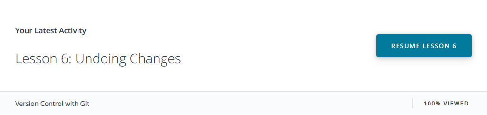

## Linux CLI, and HTTP

I worked with Unix operating system (Mac OS) earlier and quite actively used the command line. It was my first experience with Linux, but it was not difficult because the commands turned out to be very similar. 
After completing course "Linux Survival" I learned and understood:
* how to execute different actions on directories and files;
* "home directory" concept;
* how to get system information;
* how to work with processes.

After completing reading articles about HTTP protocols I refreshed my knowledge about:
* HTTP headers, status codes, messages, responses, requests; 
* identification and authentication;
* HTTPS;

and discovered interesting features like:
* types of headers;
* using HTTP in web frameworks examples.

    
Linux CLI, and HTTP

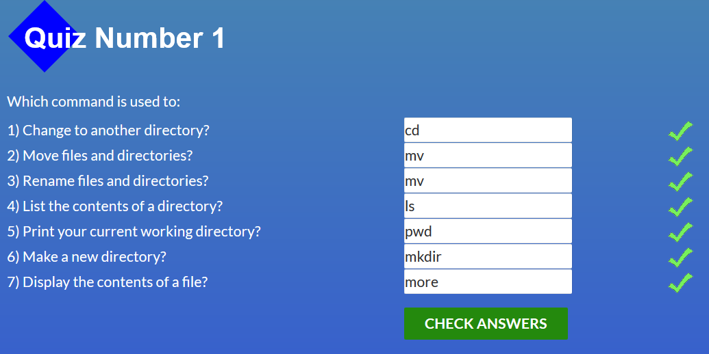
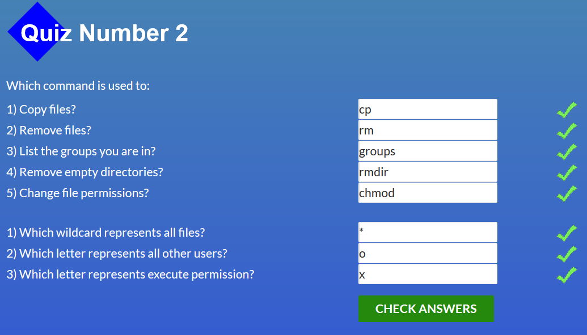
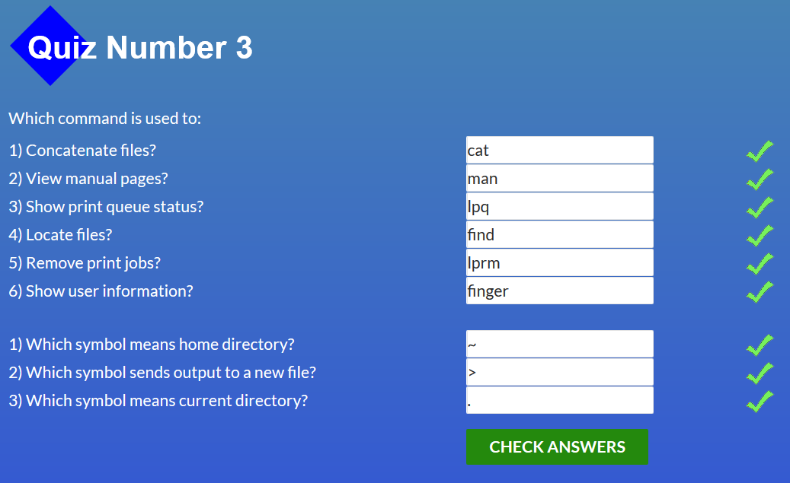
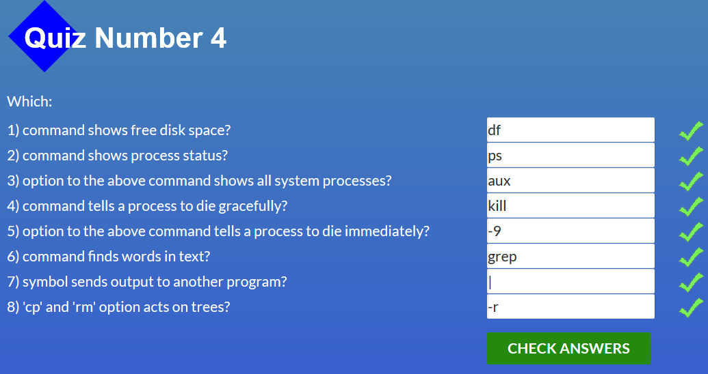

## Git Collaboration

Thanks to udacity course I improved my skills at:
* working with remote repositories;
* collaborating with other developers` repositories (forking);

I was surprised by:
* git log, it helps to discover a lot of information about the repository;
* managing PR, it seems simple;

I really liked learngitbranching. It's amazing tool. Thanks to it I understood:
* the key differences between merge and rebase;
* how to use rebase`s interactive mode;
* how to use some new to me commands and attributes;

    
Git Collaboration

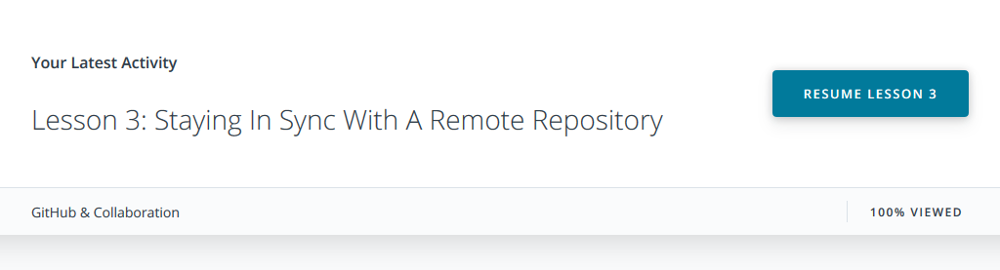
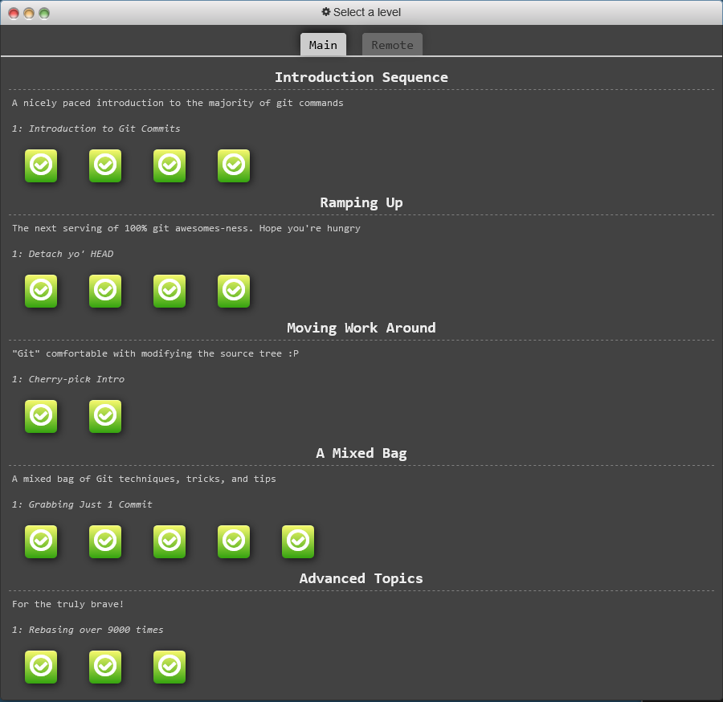
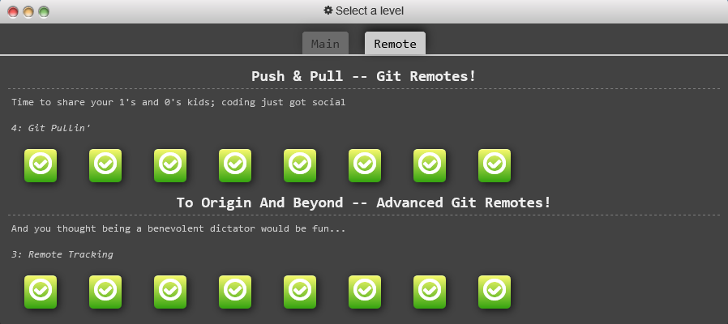

## Intro to HTML and CSS

* I improved my skills at HTML and CSS syntax;
* had good general practise;
* learned new table attributes;
* surprised by very clear default configuration of audio, video tags;
* learned and had great CSS Grid practise;

    
Intro to HTML and CSS

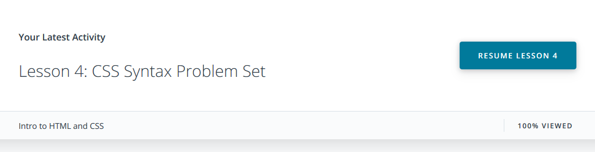
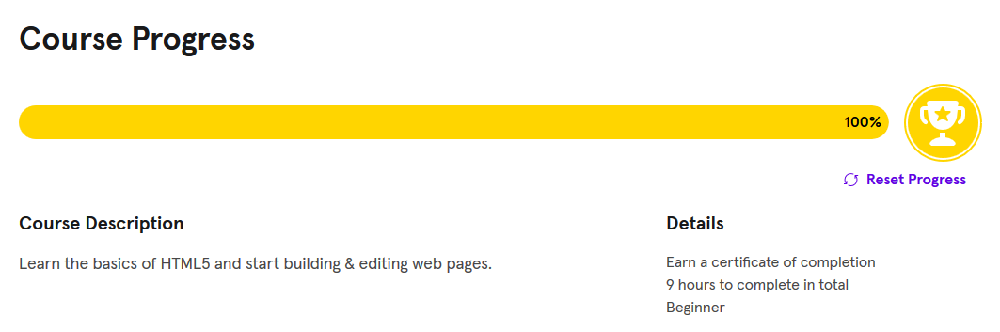
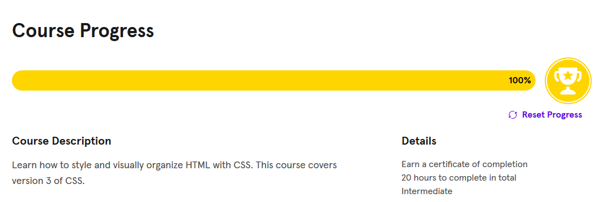

## Responsive Web Design

I improved my knowledge at:
* viewport features, responsive markup features;
* media query features, breakpoints;
* optimization tricks for tables;

I learned:
* how to set up a testing suite using a combination of physical devices, emulators and simulators;
* the specifics of how pixels on a webpage are rendered and how that impacts the development process;
* the most popular responsive layout patterns and learn the tools needed to implement them in my own designs;

I was very surprised by remote debugging tools. I realized the benefits of remote debugging for mobile and definitely I will use it.

Thanks to Flexbox Froggy I got amazing practise and improved my mastery of flexbox.

    
Responsive Web Design

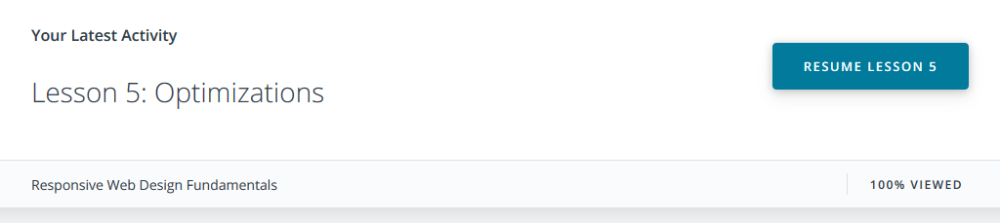
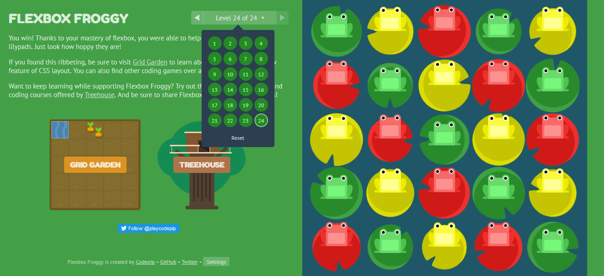

## HTML & CSS practice

#### Hooli-style Popup demo:

https://romansaiko.github.io/kottans-html-css-popup/

    
HTML & CSS practice

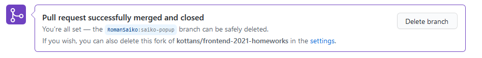

It was a great tricky task. I improved my skills at HTML and CSS. I learned how to make keyboard friendly layout and switch across all interactive elements using only keyboard.

## JS Basics

I improved my knowledge at:
* Data Types and Variables;
* Conditionals;
* Loops;
* Functions;
* Arrays;
* Objects;

I learned a lot thanks to practical tasks on freeCodeCamp.org. I also got a good practise experience in solving various tasks.

The most useful knowledge for me was:
* recursion. I understood how this can help me at my future tasks;
* how prevent data mutation (freeze() method) and why immutability so important in modern projects;
* a lot of new array and object methods and how to use them;
* functional programming and it's core principles;

The hardest part for me was solving algorithmic tasks. It was the biggest challenge for me.

    
JavaScript Basics

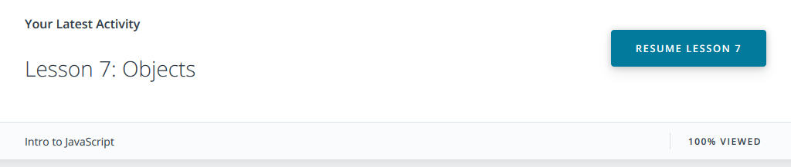
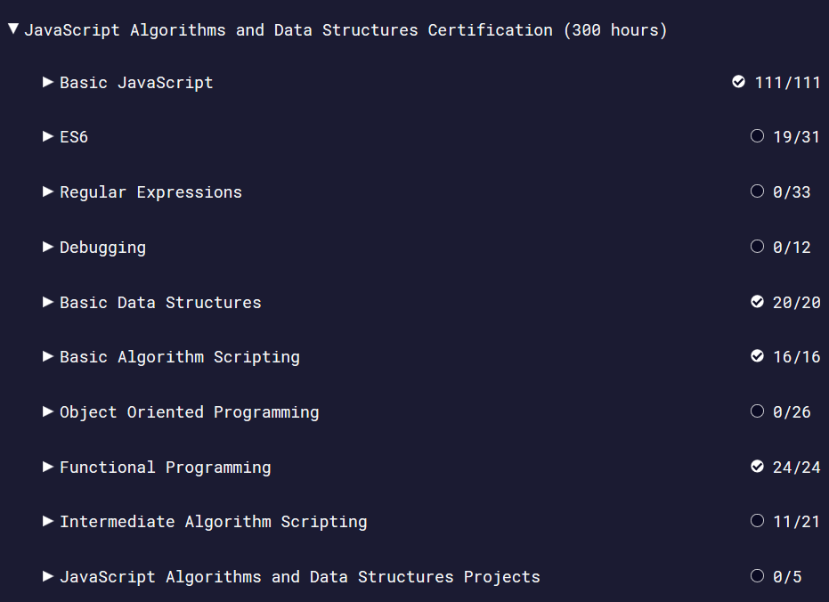

